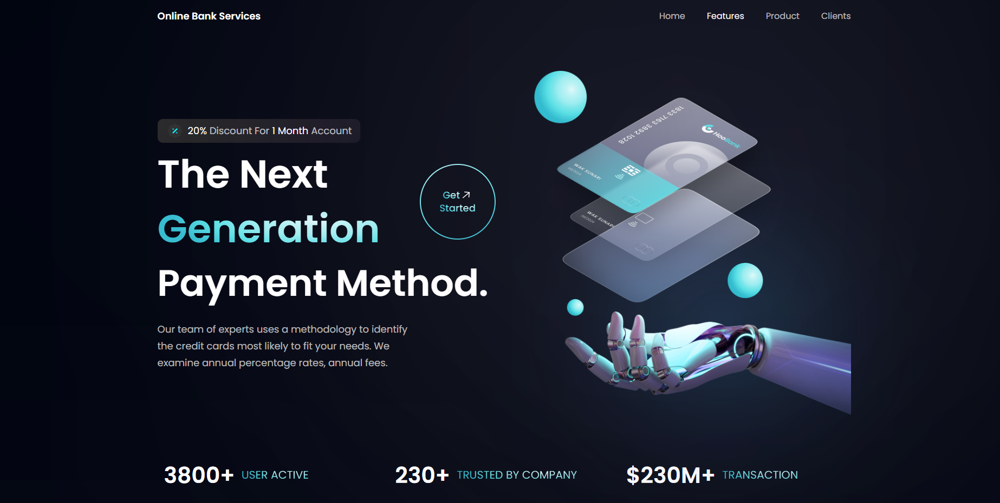

# OnlineBankServices - Modern UI/UX website using React.js & Tailwind CSS



### [✨ Visit Website](https://onlinebankservices.netlify.app/)


# OnlineBankServices

OnlineBankServices is a modern UI/UX landing page created to practice and demonstrate proficiency with TailwindCSS.

## Features

- Responsive design ensuring compatibility across various devices.
- Clean and modern user interface.
- Utilizes TailwindCSS for efficient styling.

## Technologies Used

- **HTML5**: Markup structure.
- **React**: Utility-first CSS framework for styling.
- **TailwindCSS**: Utility-first CSS framework for styling.
- **JavaScript**: For interactive elements.

## Getting Started

To view or modify this project locally:

1. **Clone the Repository**:
   ```bash
   git clone ttps://github.com/muhammadzubairbaig/online-banking-service.git

   cd online-banking-service
    ```
    ```bash
    npm install

    npm run dev
    ```

2. Open in Browser: Navigate to http://localhost:3000 to view the project.

## Deployment
The project is deployed and accessible at https://onlinebankservices.netlify.app/


## Contributing
Contributions are welcome. Please fork the repository and create a new branch for any feature or bug fix. Submit a pull request for review.


